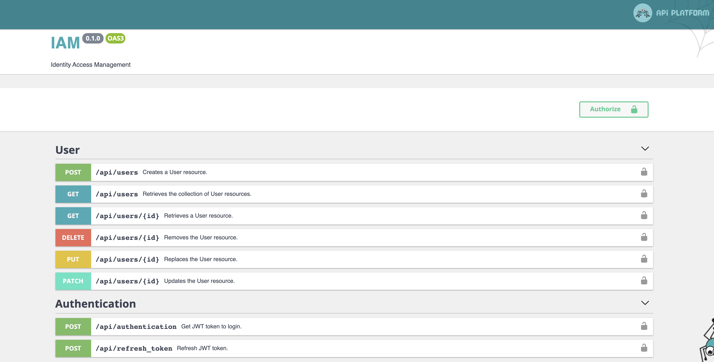

# Identity Access Management  

#### Purpose

This project was created as a boilerplate or standalone application responsible for providing identity access 
management for any service you want. It needs email and password to return JWT.

## Architecture

Project is built on the top of:
 - [Symfony](https://symfony.com/)
 - [API Platform](https://api-platform.com/)
 - [Docker](https://www.docker.com/)
 

There are two tables, `user` and `token`. Each user could have many tokens. Tokens are responsible for refreshing 
JWT and have an expiry date. Also `user` and `token` have `deleted_at` column. To set this date, you have to execute 
DB query from hand. There is a plan to develop it later. 

## Endpoints

Below screenshot present available endpoints:

## How to run it?

To run it, you need to have installed first [Docker](https://www.docker.com/). Next:
 - Go to `docker` directory copy and paste `.env.dist` without `.dist` suffix, you should end up with file `.env`
 which stores environment variables used by docker. Feel free to modify them to your purposes. 
 - Go to `app` directory and to the same with `.end.dist` file.
 - After you finish that you go once again to `docker` directory and execute the command `docker-compose up` after docker 
 finished you can start using `IAM` by going to [localhost/api](http://localhost/api) page. 